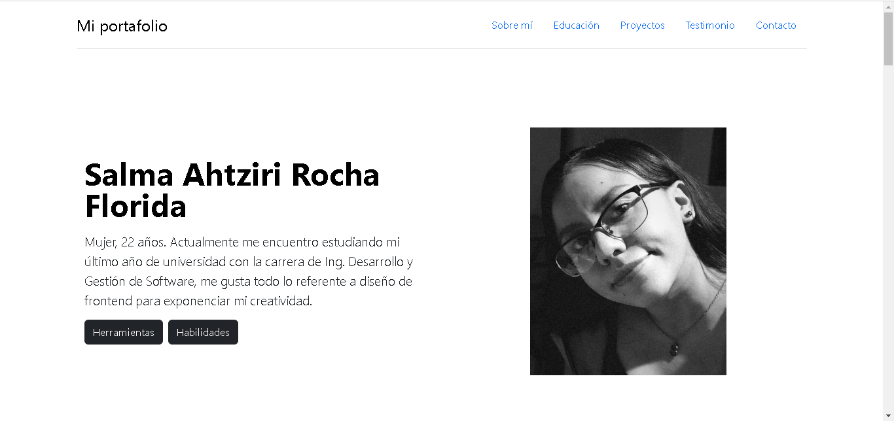
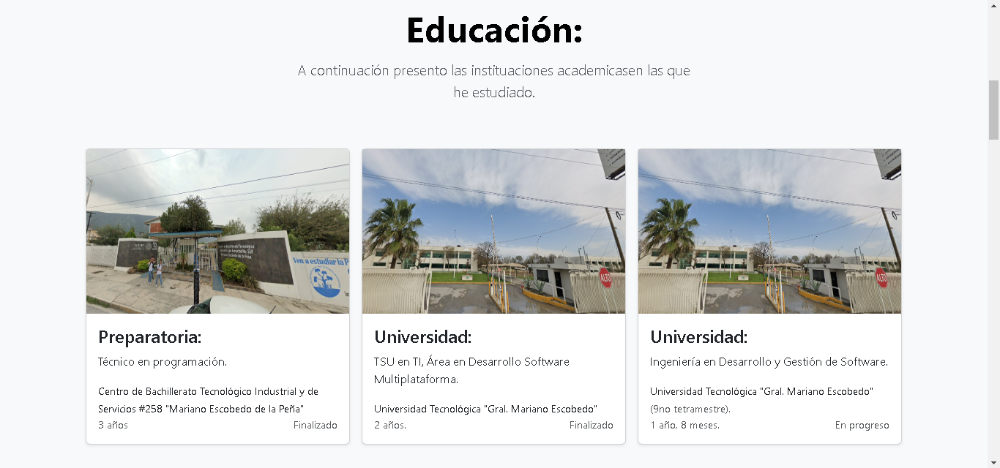
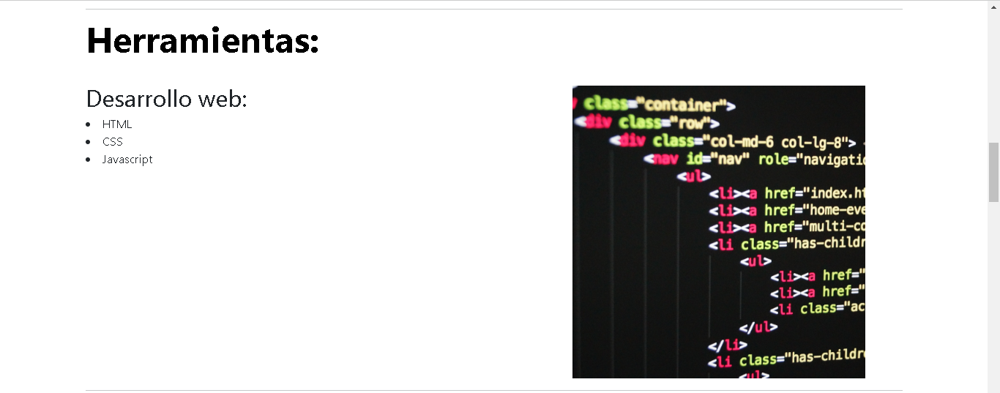
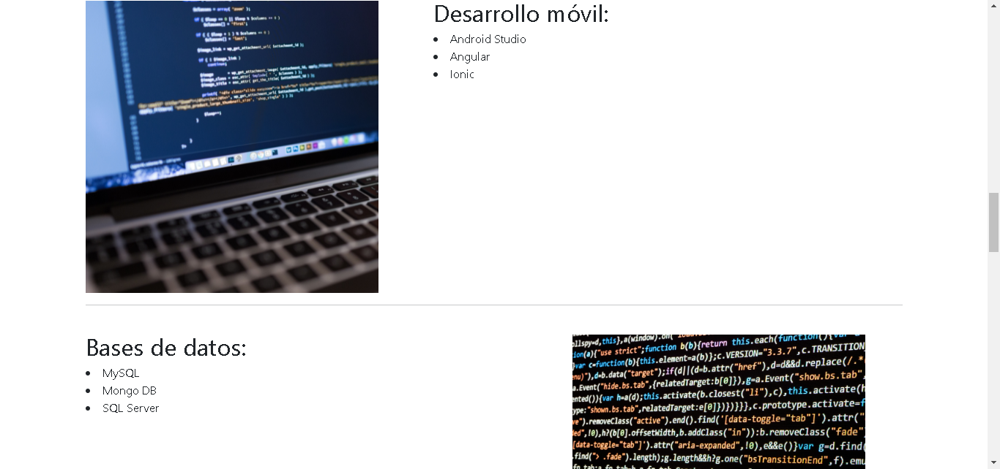
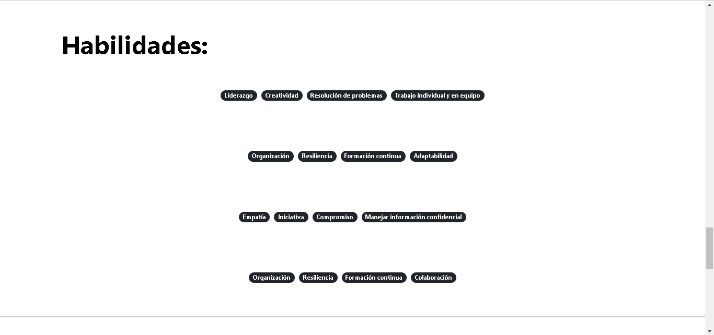
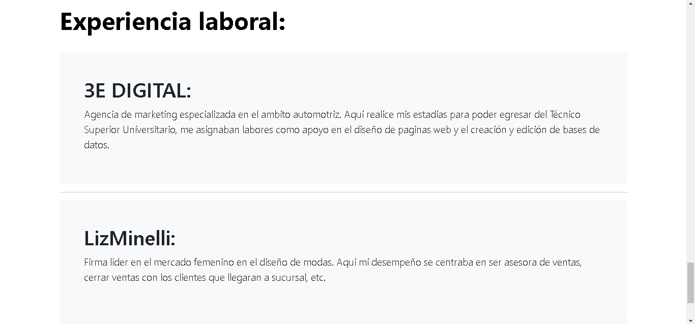

# Portafolio personal: Tecnolochicas PRO

Descripción del proyecto: 
Este proyecto fue creado durante el bootcamp Tecnolochicas PRO, para desarrollar habilidades que se conllevan en el área de Front-end.
El propósito de la creacion de este sitio web es mostrar el portafolio de proyectos de la desarrolladora y su experiencia recabada.

Incluye las secciones: Sobre mí, educación, herramientas utilizadas, habilidades y experiencia laboral.
<a href="https://main--celebrated-mandazi-bf9001.netlify.app/" target="_blank">**Échale un ojo** </a>

## Secciones

Sobre mí:

Educación:

Herramientas:
- Desarrollo web

- Desarrollo móvil y Bases de datos:

- Extras:

Habilidades:

Experiencia laboral:

## Tecnologías utilizadas
- HTML
- CSS
- JavaScript

## Contactame
https://www.linkedin.com/in/salma-ahtziri/

© 2023 Salma Ahtziri Rocha Florida